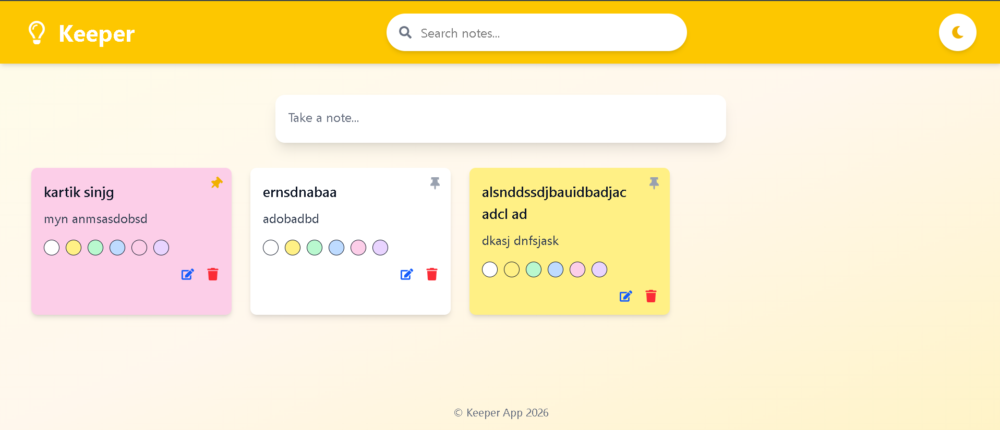
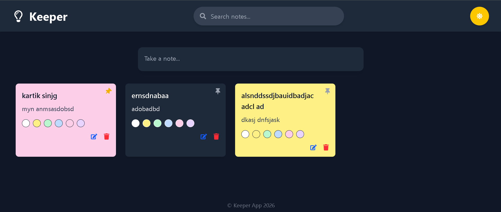

A modern note-taking application inspired by Google Keep, built using React.js and Tailwind CSS. The app allows users to create, edit, delete, pin, search, and organize notes with a clean and responsive user interface.

 # Features

- Create notes with title and content
- Edit existing notes
- Delete notes
- Pin important notes
- Search notes instantly
- Change note colors
- Dark & Light Mode
- Local Storage support (notes remain after page refresh)
- Responsive design for desktop and mobile


# Tech Stack

- React.js
- Tailwind CSS
- JavaScript (ES6+)
- React Icons
- Local Storage API

# Project Structure

```
src/
├── components/
│   ├── Header.jsx
│   ├── Footer.jsx
│   ├── CreateArea.jsx
│   └── Note.jsx
├── App.jsx
├── main.jsx
└── index.css
```

# Installation


1. Navigate to the project folder

```bash
cd keeper-app
```

2. Install dependencies

```bash
npm install
```

3. Start the development server

```bash
npm run dev
```

# Preview






## 🌟 Future Improvements

- User Authentication
- Cloud Storage
- Categories & Labels
- Drag and Drop Notes
- Reminder Feature
- Speech to text

# Author

**Kartik Singh**

GitHub: https://github.com/kartiksinghks2005-arch
live-Demo: https://notes-keeper22.netlify.app/
